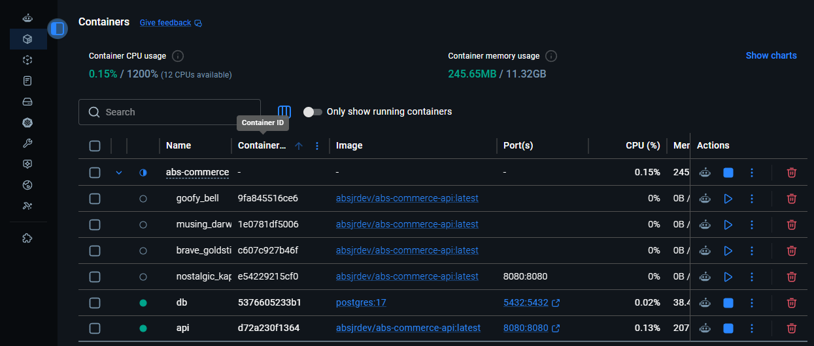
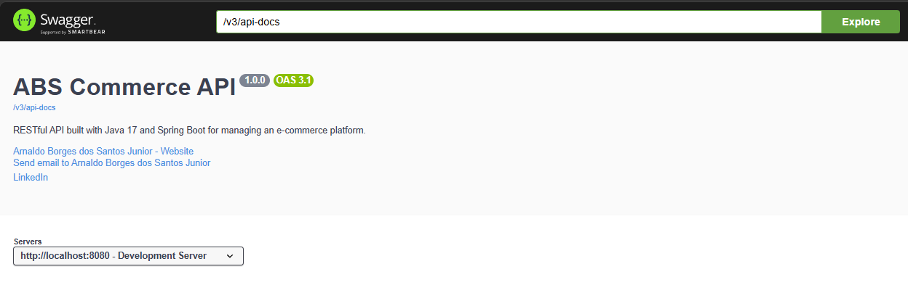
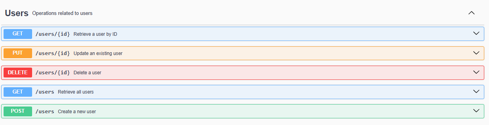
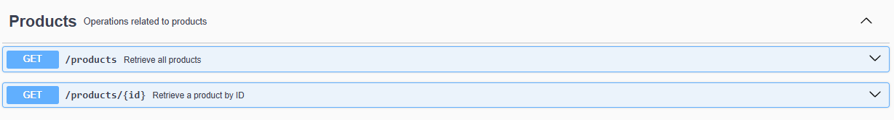

# ABS Commerce API


---

# 🚀 About

**ABS Commerce API** is a backend application that simulates a modern e-commerce platform built with **Java** and **Spring Boot**.

The project is part of the **ABS — Application Backend Solutions** portfolio and was created to demonstrate enterprise backend development practices, focusing on scalability, clean architecture, maintainability, and real-world business rules.

Although developed as a learning project, the application follows professional software engineering principles and continues to evolve with new features and infrastructure improvements.

---

# ✨ Features

Current implemented features:

- User Management
- Product Management
- Category Management
- Order Management
- Payment Association
- Order Status Management
- RESTful API
- Layered Architecture
- Docker Support
- PostgreSQL Integration
- H2 Database for Testing
- Swagger / OpenAPI Documentation

---

# 🏛 Domain Model

Main entities:

- User
- Product
- Category
- Order
- OrderItem
- Payment

Business rules:

- One user can have multiple orders.
- Orders can contain multiple products.
- Products belong to multiple categories.
- Orders may contain payment information.
- Orders have lifecycle status management.

Order status:

- WAITING_PAYMENT
- PAID
- SHIPPED
- DELIVERED
- CANCELED

---

# 🛠 Technologies

## Backend

- Java 17
- Spring Boot 3
- Spring Data JPA
- Hibernate
- Maven

## Database

- PostgreSQL (Production)
- H2 Database (Testing)

## Infrastructure

- Docker
- Docker Compose

## Documentation

- Swagger / OpenAPI

---

# 📂 Project Structure

```text
src
└── main
    └── java
        └── com.absjrdev.abscommerce
            ├── category
            ├── config
            ├── exception
            ├── order
            ├── orderItem
            ├── payment.domain
            ├── product
            ├── user
            └── AbsCommerceApplication
```

> As the project evolves, new packages such as DTOs, validation, security, and services will be introduced.

---

# 🏗 Architecture

The project follows a layered architecture.

```text
Controller
     │
     ▼
Service
     │
     ▼
Repository
     │
     ▼
Database
```

Design principles:

- Separation of Concerns
- SOLID Principles
- Clean Code
- Layered Architecture
- Scalability
- Maintainability

---

# ⚙ Application Profiles

The application currently supports two Spring profiles.

## test

Used during development.

Database:

- H2 In-Memory Database

Configuration:

```properties
spring.profiles.active=test
```
## Demo Data

When running the application using the `test` profile, the database is automatically populated with sample data.

This allows anyone to test the API immediately without manually creating entities.
---

## prod

Used for production and Docker environments.

Database:

- PostgreSQL

Configuration:

```properties
spring.profiles.active=prod
```

---

# 🐳 Running with Docker

Clone the repository.

```bash
git clone https://github.com/absjrdev/abs-commerce.git

cd abs-commerce
```

Create your environment file.

```bash
cp .env.example .env
```

Build and start the application.

```bash
docker compose up --build
```

Application running with Docker Compose.



The API will be available at:

```
http://localhost:8080
```

Swagger UI:

```
http://localhost:8080/swagger-ui/index.html
```

---

# 💻 Running Locally

Requirements:

- Java 17
- Maven

Run:

```bash
./mvnw spring-boot:run
```

---

# 🔑 Environment Variables

Example:

```properties
POSTGRES_DB=abs-commerce

POSTGRES_USER=postgres

POSTGRES_PASSWORD=postgres

SPRING_PROFILES_ACTIVE=prod

SPRING_DATASOURCE_URL=jdbc:postgresql://postgres:5432/abs-commerce

SPRING_DATASOURCE_USERNAME=postgres

SPRING_DATASOURCE_PASSWORD=postgres
```

---

# 📖 API Documentation

The API is documented using Swagger / OpenAPI.

Access:

http://localhost:8080/swagger-ui/index.html

## Swagger UI



### User Endpoints



### Product Endpoints


---

# 📈 Roadmap

## Completed

- REST API
- Spring Boot
- PostgreSQL
- H2 Database
- Docker
- Docker Compose
- Swagger
- Entity Relationships

## In Progress

- DTO Layer
- Validation
- JWT Authentication
- Exception Handling Improvements
- Unit Tests
- Integration Tests

## Planned

- GitHub Actions (CI/CD)
- Docker Hub Automated Builds
- Kubernetes
- Cloud Deployment
- Monitoring
- Logging Improvements

---

# 👨‍💻 Author

**Arnaldo Borges dos Santos Junior**

Backend Developer

GitHub:

https://github.com/absjrdev

---

# 📄 License

This project is licensed under the MIT License.
